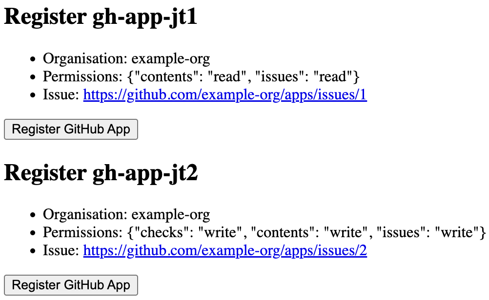

# GitHub App Manifest Flow

This is an example implementation of the [GitHub App Manifest flow](https://docs.github.com/en/enterprise-cloud@latest/apps/sharing-github-apps/registering-a-github-app-from-a-manifest#implementing-the-github-app-manifest-flow), built with Copilot.

It consists of a webserver that serves GitHub App manifests and handles redirections after the app registration. The server needs to be publicly resolvable for GitHub to forward the redirection requests.

## Example end to end implementation


## Setup Ngrok
You can use ngrok to resolve public requests from GitHub to your internal server.

Follow [ngrok instructions](https://dashboard.ngrok.com/) to install and configure ngrok.

In a separate terminal, run:
```shell
ngrok http http://127.0.0.1:5000
```

Take note of the domain `<uuid>.ngrok-free.app` from the output, i.e.
```
https://aabbccddeeff.ngrok-free.app -> http://127.0.0.1:5000
```


## Start Server

```shell
python3 -m venv venv
source venv/bin/activate
pip3 install -r requirements.txt

export SERVER_URL=https://<PUBLIC DOMAIN>
python3 server.py
```


### Example requests screen

